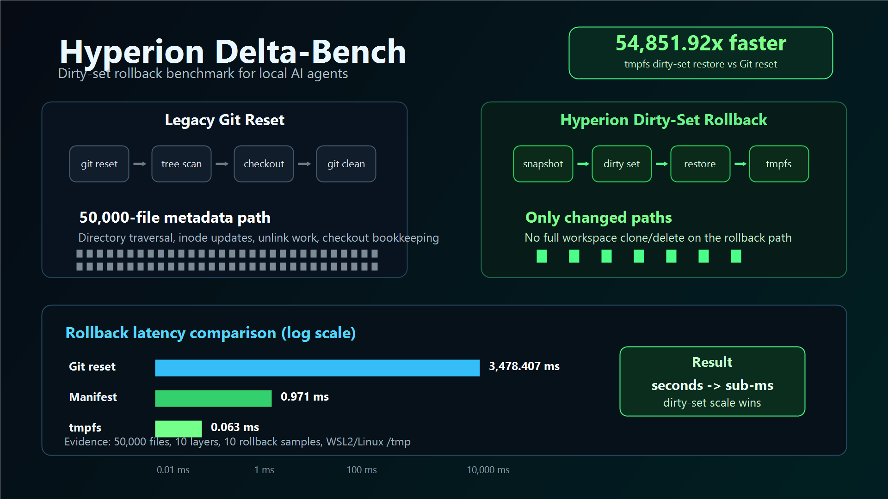

# Hyperion Delta-Bench

Hyperion Delta-Bench proves a simple systems result for local AI agents: rollback should scale with the files the agent changed, not with the size of the whole repository.

In the final audit run, Git reset took `3,478.407 ms` per rollback. Hyperion's targeted manifest restore took `0.971 ms`. The tmpfs dirty-set path took `0.063 ms`, a `54,851.92x` speedup over Git.



## Benchmark Result

The benchmark synthesizes a 50,000-file TypeScript workspace nested 10 directories deep, then measures rollback cycles with `process.hrtime.bigint()`.

| Runner | Total I/O Block Time | Average Rollback Latency | Samples | Speedup vs Git | Reduction vs Git |
| --- | ---: | ---: | ---: | ---: | ---: |
| Legacy Runner (`git reset --hard` + `git clean -fd`) | `34,784.070 ms` | `3,478.407 ms` | 10 | `1.00x` | `0.00%` |
| Targeted Reversion (manifest file restore) | `9.715 ms` | `0.971 ms` | 10 | `3,580.50x` | `99.97%` |
| Targeted Reversion (`rsync` file-list/link-dest) | `504.942 ms` | `50.494 ms` | 10 | `68.89x` | `98.55%` |
| Targeted Reversion (tmpfs dirty-set restore, WSL2) | `0.634 ms` | `0.063 ms` | 10 | `54,851.92x` | `100.00%` |

Raw evidence:

- [`benchmark-final-run.log`](./benchmark-final-run.log)
- [`benchmark-final-table.png`](./benchmark-final-table.png)
- [`benchmark-final-full.png`](./benchmark-final-full.png)

## Why This Matters For Agents

Local coding agents do not just edit once. They mutate files, run tests, fail, backtrack, and try another branch. If every failed attempt pays a multi-second Git reset or full-tree clone/delete penalty, search quality gets capped by filesystem latency instead of model reasoning.

Hyperion's result is not "copy-on-write always wins." The first full-tree CoW clone/delete design was slower than Git because it still churned through tens of thousands of directory entries and inodes. The winning strategy is targeted state reversion:

- Git reset scales with repository-wide filesystem inspection.
- Full tree clone/delete scales with repository-wide metadata churn.
- Hyperion manifest rollback scales with the dirty set.
- tmpfs dirty-set rollback shows the upper bound when rollback metadata and content stay in RAM.

For Prettiflow-style local MCTS or repair loops, that means an agent can test far more branches without leaving the developer's workspace dirty.

## SDK Quickstart

The production SDK surface is exposed as `@prettiflow/hyperion-delta`. Prettiflow-style agent loops can use the adapter wrapper with only the checkpoint lifecycle in their execution path:

```ts
import { HyperionAgentSession } from "@prettiflow/hyperion-delta";

const session = new HyperionAgentSession(process.cwd());

try {
  await session.runAttempt(async ({ exec }) => {
    await runAgentAttempt();
    await exec("npm", ["test"]);
  });
} finally {
  await session.dispose();
}
```

`HyperionAgentSession` is a thin wrapper over `HyperionWorkspace`. It installs Node fs interception by default, exposes the selected strategy, stores the last reconcile result, and records rollback timing in milliseconds. `runAttempt()` creates a checkpoint, reconciles after explicit child-process execution, and rolls back automatically when the attempt throws. Child-process and native-tool writes are still protected by the mandatory reconcile call inside `rollback()`.

Successful attempt checkpoint release is intentionally not a separate public API yet. For this phase, adapter users keep the workspace session alive across attempts and call `dispose()` during CLI shutdown; a dedicated commit/release method is deferred until the core checkpoint lifecycle grows that contract.

## API Reference

The package exports two runtime entry points:

- `HyperionWorkspace`: the core checkpoint, reconcile, rollback, VFS interception, and cleanup API.
- `HyperionAgentSession`: a Prettiflow-oriented wrapper that installs interception by default and records diagnostics.

Core methods:

- `track(path | paths)`: manually register paths for future integrations that cannot use interception.
- `snapshot()`: capture a checkpoint and return a `CheckpointId`.
- `reconcile(checkpointId?)`: refresh dirty-set state after child-process or native-tool writes.
- `rollback(checkpointId)`: reconcile, restore dirty paths, delete created paths, and clean ghost directories.
- `recoverAttempts()`: inspect durable checkpoint journals left under `.hyperion/checkpoints`.
- `dispose()`: unregister hooks/interceptors and clean Hyperion-owned session state.

Agent-session helpers:

- `runAttempt(callback, options?)`: wrap one agent attempt with automatic snapshot, reconciliation, rollback-on-throw, and diagnostics.
- `exec(command, args, options?)`: run an explicit executable plus argument array without shell-string execution. Inside `runAttempt()`, the context `exec()` reconciles the active checkpoint after the process exits.

Public types and errors are exported from the package root, including `HyperionConfig`, `ReconcileResult`, `StorageStrategyKind`, `HyperionError`, `HyperionCapacityError`, `HyperionIntegrityError`, `HyperionPathError`, and `HyperionRollbackError`.

Small regular-file backups use a bounded in-memory Hot Dirty Buffer by default before spilling to the selected physical strategy. Tune it with `useHotBuffer`, `hotBufferMaxFileBytes`, `hotBufferMaxTotalBytes`, and `hotBufferMaxFiles`; the exported defaults are `256 KiB` per file, `8 MiB` total, and `1024` files.

Ignored dependency and generated-output roots are still excluded from broad scans, but VFS-captured writes into ignored paths can be made fail-fast with `strictIgnoredWrites: true`. Explicit `track()` calls may name exact ignored paths for future tool-adapter integrations without expanding broad reconciliation walks.

Durable attempt journals are enabled by default with `durableAttemptJournals: true`. Each checkpoint writes metadata to `.hyperion/checkpoints/<checkpointId>/journal.json` before the ID is returned. The journal records checkpoint metadata, strategy, Git HEAD, ignored patterns, baseline metadata, and dirty-entry summaries, but never file contents. `recoverAttempts()` is inspect-only in this phase; Git still owns permanent history, merging, commits, and pushes.

See [ARCHITECTURE.md](./ARCHITECTURE.md) for the full system design, failure model, and strategy router details. The limitations and mitigation roadmap live in [LIMITATIONS.md](./LIMITATIONS.md). Release and security posture notes live in [RELEASE.md](./RELEASE.md) and [SECURITY.md](./SECURITY.md).

## Release Checks

For local package readiness:

```sh
npm run release:check
```

This runs typecheck, tests, build, `npm pack --dry-run`, and a temp-project install smoke. The install smoke packs the SDK into an OS temp directory, installs it into a temporary sample project, and imports both `HyperionWorkspace` and `HyperionAgentSession` from the installed package.

For a focused install smoke after an existing build:

```sh
npm run package:smoke
```

The published package is intentionally limited to `dist`, the README/architecture docs, the benchmark hero image used by the README, and required npm metadata. Benchmark commands are repository-checkout utilities and are not part of the SDK runtime surface.

## Troubleshooting

- Git unavailable: Hyperion falls back to stat-only manifests. Correctness remains, but large non-Git workspaces may start slower.
- tmpfs unavailable: Linux `/dev/shm` acceleration is skipped and the SDK degrades to POSIX links or pure manifest restore.
- `rsync` unavailable: POSIX-link-style benchmark rows may be skipped, and SDK behavior remains on the safest available strategy.
- Windows or NTFS: the SDK uses the pure manifest baseline for correctness rather than POSIX-only link assumptions. Small VFS-backed edits are accelerated by the Hot Dirty Buffer before spilling to disk.
- Ignored paths: `node_modules/**`, `.git/**`, and `.hyperion/**` are ignored by default so dependency and internal state folders are not tracked.
- Strict ignored writes: set `strictIgnoredWrites: true` to throw `HyperionIgnoredPathError` before in-process VFS writes mutate ignored roots.
- Durable journal recovery: call `recoverAttempts()` from a new workspace/session to inspect abandoned checkpoint metadata. This does not rehydrate rollback-capable storage yet.
- Child-process modified/deleted files: `reconcile()` detects them, and `rollback()` always reconciles first. Restoring modified or deleted files still requires a pre-mutation backup from VFS interception or a future explicit tracking integration.
- Missing backup record: rollback fails loudly with an integrity error instead of silently corrupting or partially restoring the workspace.

## What It Measures

The current benchmark compares:

- `Legacy Runner`: mutates a tracked file, creates an untracked scratch file, then runs `git reset --hard HEAD` and `git clean -fd`.
- `Targeted Reversion`: tracks the modified files in a manifest, restores only those files from a read-only base, and deletes only manifest-listed scratch files.
- `rsync Targeted Reversion`: creates a linked working tree with `rsync --link-dest`, then restores only changed files with an rsync file list.
- `tmpfs Targeted Reversion`: keeps the dirty-set rollback cache in `/dev/shm` on Linux/WSL2 so the files the agent actually touched restore from RAM.

## Lessons from the Metadata Bottleneck

Initial testing revealed that standard directory cloning strategies trigger inode metadata thrashing on 50k+ file systems, outperforming Git only on block-level I/O but failing on metadata throughput.

The first implementation used Linux reflinks with `cp -a --reflink=always`, then deleted and recloned the whole 50,000-file sandbox every turn. On the WSL2 XFS loopback test drive, it produced this result:

```text
Legacy Runner total:   190,694.525 ms
Legacy average:         3,813.890 ms

Hyperion full clone total: 816,614.450 ms
Hyperion full clone avg:    16,332.289 ms
```

That failure is useful. Reflinks avoid copying file blocks, but they do not eliminate directory traversal, inode allocation, unlink work, or metadata updates. A real local agent should not throw away an entire tree when it knows which files it touched.

Hyperion's practical optimization is therefore targeted state reversion: track the agent's dirty set and revert only those paths. The tmpfs mode demonstrates the upper bound for Prettiflow-style local search when dirty-set content and metadata operations live in RAM.

## Running The Benchmark

For a fast local regression check:

```sh
npm run benchmark:smoke
```

Smoke mode uses a small fixture and temporary work root. It validates the benchmark shape and strategy routing, not final performance evidence.

For the full benchmark defaults:

```sh
npm run benchmark
```

The full run preserves the audit-scale defaults in `benchmark.ts`. For the cleanest filesystem signal, run inside a native Linux filesystem or the XFS loopback mount used during audit testing. The tmpfs row appears automatically when `/dev/shm` is available.

When launched from WSL under `/mnt/c`, the script automatically stages generated benchmark workspaces in native Linux `/tmp` and prints the selected work root. This keeps the requested Windows project path usable while avoiding DrvFS metadata emulation from dominating the benchmark.

The benchmark prints the selected work root, fixture size, iteration count, and runner strategy rows. If optional capabilities are unavailable, such as `rsync` or Linux `/dev/shm`, those rows are reported as skipped instead of failing the run.

The script also accepts environment overrides while preserving the audit defaults:

```sh
HYPERION_FILE_COUNT=1000 HYPERION_ITERATIONS=3 npm run benchmark
```

## Interpreting Results

The target outcome is not "copy-on-write always wins." The meaningful result is:

- Git reset scales with repository-wide filesystem inspection.
- Full tree clone/delete scales with repository-wide metadata churn.
- Targeted rollback scales with the number of files the agent actually changed.
- tmpfs dirty-set rollback shows the best-case latency when the rollback cache avoids disk hardware entirely.

## Benchmark Ideas To Run Next

The current final run is intentionally narrow: a 50,000-file fixture, one simulated agent edit cycle, and 10 measured rollback samples. The next useful benchmark work is to map the performance envelope:

- Dirty-set size sweep: 1, 10, 100, and 1,000 changed files.
- Repository size sweep: 10k, 50k, 100k, and 250k files.
- Platform matrix: WSL2, native Linux, macOS APFS, and Windows NTFS.
- Tooling matrix: `tsc`, formatters, generated snapshots, package-manager outputs, `esbuild`, `oxc`, and SWC.
- Strategy matrix: Git reset, manifest restore, POSIX link storage, and tmpfs dirty-set storage.
- Cache matrix: cold-cache and warm-cache runs.
- Agent-search stress test: concurrent checkpoints and MCTS-style branch rollback.

Those runs should keep the same rule as this benchmark: measure rollback latency with `process.hrtime.bigint()`, print the work root, report skipped platform-specific strategies explicitly, and never hide metadata-heavy failures. The full-tree clone/delete miss is part of the engineering evidence.
